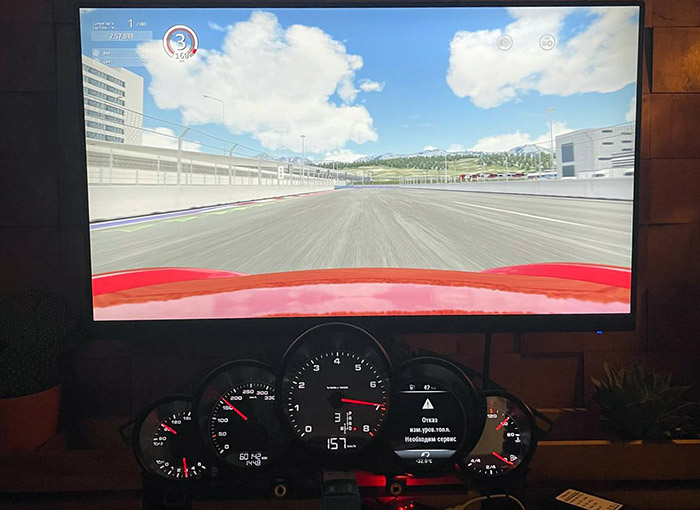
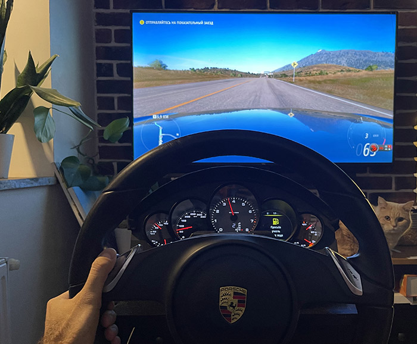
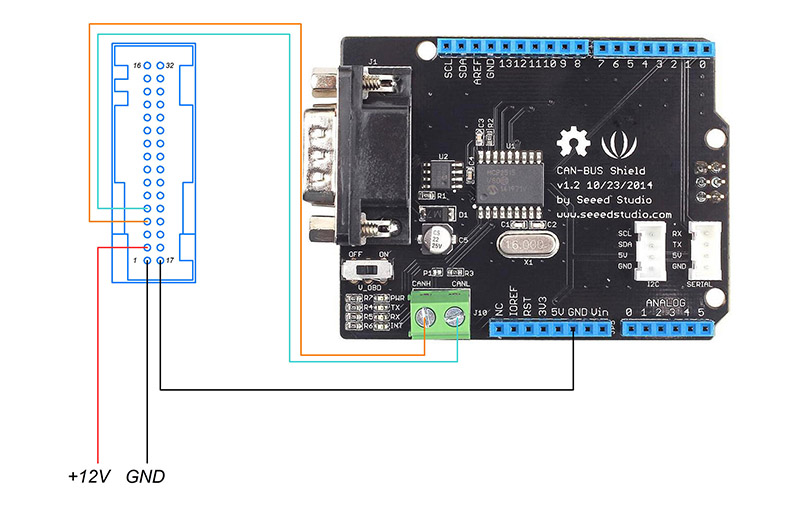

## Адаптация приборной панели Porsche 970 рестайлинг для автосимуляторов 
## Porsche cluster (car dashboard) Panamera 970/ Cayenne for simracing games 
Отображаем данные из игр на реальной приборной панели от Porsche Panamera 970 рестайлинг (от Cayenne также должна подойти)

## Поддержка игр сейчас
- Assetto Corsa<br></br>
  
- Forza Horizon 5<br></br>
  

## Материалы, которые очень помогли
- За основу для Arduino + Can shield взят код -  [Arduino Porsche Cluster](https://github.com/VintageCollector/cluster-dashboard-ets2-ats/tree/Porsche-Panamera-970)
- Для доработок использованы команды из списка - [CAN-Bus-ID Porsche Cluster 970](https://github.com/VintageCollector/Porsche_Panamera_970-CAN-Bus-ID)
- Образец телеметрии для Assetto Corsa - [Assetto Telemetry Example](https://github.com/ladothlak/self-driving-NASCaiR)

## Что сделано
- Отправка основных данных на панель с Can шилда через Arduino
- Телеметрия Assetto Corsa и взаимодействие с шилдом
- Схема отображения топлива на приборной панели

## Схема подключения и структура проекта

Минимальная схема подключения<br></br>


Структура проекта
<pre>
├── telemetry - скрипты для сбора телеметрии и отправка на dash
    ├── games - доступные ингры
        ├── asetto_corsa.py - сбор данных Asetto Corsa
        ├── fh5.py - сбор данных из памяти Forza Horizon 5
        ├── data_example_fh5.txt - формат данных в памяти Forza Horizon 5
        └── data_example_assetto_corsa.txt - формат данных в памяти AsettoCorsa
├── porsche_cluster_arduino - код для Arduino
    └── porsche_cluster_arduino.ino
├── files - разные файлы, схемы и т.д.
├── requirements.txt - зависимости для старта python скрипта
├── env.example - env проекта
├── run_dashboard.bat - файл для быстрого запуска скрипта
└── README.md - описание проекта
</pre>

## Инструкции по запуску проекта

- Прошить Arduino Uno прошивкой:
```
.../porsche_cluster_arduino/porsche_cluster_arduino.ino
```

- Клонировать репозиторий в командной строке (на ПК):
```
git clone https://github.com/lex232/Dashboard-for-autosimulators.git
```
- Перейдите в скачанную директорию:
```
cd Dashboard-for-autosimulators
```
- Cоздайте виртуальное окружение. В системе должен быть установлен интерпретатор языка Python
- Вместо команды `python` возможны также варианты: `python3` или `py`
```
python -m venv venv
```
- Активировать виртуальное окружение на ОС Linux:
```
source venv/bin/activate
```
- Активировать виртуальное окружение на ОС Windows:
```
venv/Scripts/activate
```    
- Ообновить пакетный менеджер
```
python -m pip install --upgrade pip
```
- Установить зависимости из файла requirements.txt:
```
pip install -r requirements.txt
```    
- Переименовать .env.example -> .env и изменить номер COM-порта на свой, также выбрать игру:
```
COM='x'
GAME='ASETTO_CORSA'
```    
- Перейти в папку telemetry:
```
cd telemetry
```    
- Запустить скрипт (игра уже должна быть начата):
```
python telemetry_reader.py
```    
- Или: Настроить файл для быстрого запуска
```
run_dashboard.bat
```    

